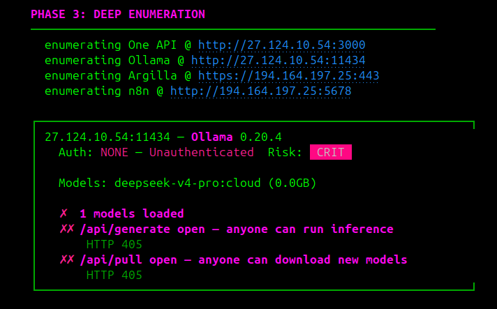
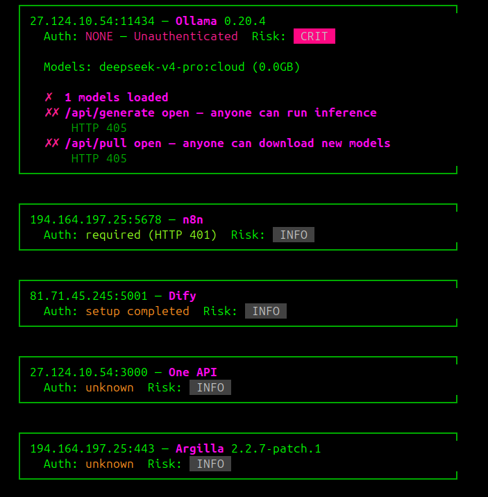
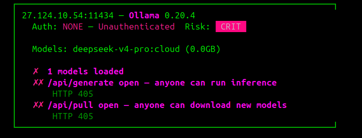
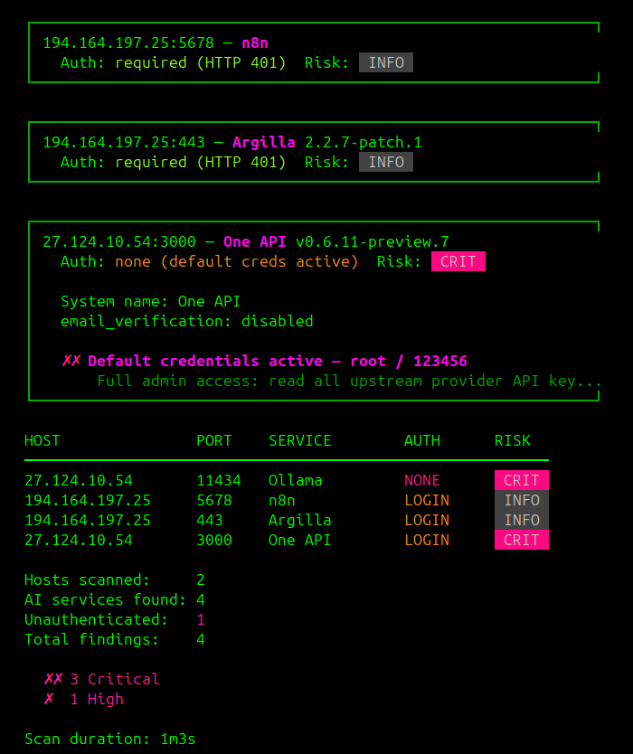

Fingerprint AI/ML infrastructure at population scale and enumerate what is exposed inside.

## Screenshots

**Phase 2 — AI service fingerprinting**


**Phase 3 — Deep enumeration**


**Service cards**


**Ollama — unauthenticated inference (CRIT)**


**One API — default credentials active (CRIT)**


**Full summary — 11 hosts, 14 services, ML-adjacent infrastructure**


## Install

```
go install github.com/nuclide-research/aimap@latest
```

Or build from source:

```
git clone https://github.com/nuclide-research/aimap
cd aimap
go build -o aimap .
```

Pre-built Linux amd64 and arm64 binaries are on the releases page.

Go 1.21+, zero external dependencies.

## Usage

```
aimap -target 192.0.2.10
aimap -target 10.0.0.0/24 -threads 50 -o audit.json
aimap -list ips.txt -ports-class llm-gateway -threads 30 -o out.json
aimap -version
```

| Flag | Default | Effect |
|------|---------|--------|
| `-target` | (required) | single IP, hostname, or CIDR |
| `-list` | | file of targets, one per line; `#` comments supported |
| `-ports` | 42-port default set | comma-separated port list |
| `-ports-class` | | named port profile (see below); overrides `-ports` |
| `-timeout` | `5s` | per-connection timeout |
| `-threads` | `20` | concurrent scan threads |
| `-o` | | JSON report output file |
| `-v` | off | verbose output |
| `-scan-all-fingerprints` | off | probe every fingerprint on every open port, bypassing the DefaultPorts filter |
| `-exclude-compromised` | off | drop extortion-wiped hosts (Meow-class) from the report |
| `-version` | | print version and exit |

Default 42-port list: `80,443,1984,2379,3000,3001,4000,4040,4200,5000,5001,5678,6333,7575,7576,7860,8000,8001,8080,8081,8088,8123,8233,8265,8443,8501,8787,8888,8889,9000,9090,9091,9200,10000,11434,15500,18080,18789,19530,30000,51000,55000`

## Port profiles

`-ports-class <name>` narrows the port list to a hand-curated set for a specific
service class. On a typical population survey this gives a 5-10x wall-time
reduction compared to the 42-port default.

| Profile | Ports | Best for |
|---------|-------|----------|
| `llm-gateway` | 12 ports | Ollama, vLLM, TGI, Open WebUI, LiteLLM, sub2api |
| `vector-db` | 11 ports | Qdrant, Weaviate, ChromaDB, Milvus |
| `observability` | 10 ports | Langfuse, Helicone, MLflow, Phoenix, Prometheus |
| `registry` | 11 ports | Docker, Harbor, Quay |
| `network-mesh` | 19 ports | Envoy admin, Istio, Linkerd, Kiali, Cilium |
| `workflow-orch` | 10 ports | Prefect, Dagster, Temporal, Argo |
| `browser-control` | 9 ports | CDP, Selenium Grid, Playwright MCP |
| `sub2api` | 6 ports | sub2api-class pooled-account proxies |
| `jetson` | 11 ports | Jetson edge AI, Triton, Frigate |
| `healthcare` | 10 ports | DICOM / PACS / dcm4chee / Orthanc |
| `finance` | 10 ports | QuantConnect, OpenBB, JESSE |
| `mcp` | 9 ports | Model Context Protocol servers |
| `wide` | 42 ports | the default catch-all, explicit selection |
| `minimal` | 4 ports | quick host-alive HTTP probe |

Define new profiles in `port_classes.go`: one map entry, no other files touched.

## What aimap fingerprints (218 services, 62 deep enumerators)

| Category | Services |
|----------|----------|
| Vector databases | Weaviate, ChromaDB, Qdrant, Milvus, Marqo, Manticore, SurrealDB, Infinity (InfiniFlow), Databend, GreptimeDB, Epsilla, OceanBase, Neo4j, Couchbase, Apache Solr, Meilisearch, Typesense, Vespa |
| LLM runtimes | Ollama, llama.cpp server, vLLM, SGLang, LocalAI, text-generation-webui |
| RAG frameworks | AnythingLLM, LightRAG, PrivateGPT, txtai, Cognita, R2R, Kotaemon, Quivr, Danswer/Onyx, Verba, DocsGPT, Ragapp, Perplexica, RAGFlow |
| Image generation | ComfyUI, AUTOMATIC1111 / SD WebUI, InvokeAI, Fooocus, SwarmUI |
| Embedding servers | HuggingFace TEI, infinity-embedding, Embedding API |
| Model serving | TensorFlow Serving, Triton Inference Server, NVIDIA NIM |
| ML platforms | MLflow, Weights & Biases, WandB Service, ClearML, Aim |
| Orchestration / UI | LangServe, Flowise, Dify, Open WebUI, SillyTavern, LiteLLM, One API, NewAPI, BentoML, sub2api |
| AI agent platforms | OpenHands, AutoGen Studio, Anti-detect CDP server, Mem0, Coolify, OpenClaw |
| MCP servers | MCP Server |
| Code assistants | Sourcegraph, Sourcebot, Sweep AI, Tabnine Context Engine, Dyad, bolt.diy, Refact |
| Agent memory | Mem0, Argilla, Zep, Letta |
| Data labeling | Label Studio, CVAT, Doccano, Prodigy |
| Compute orchestration | Ray Serve, Ray Dashboard, Kubeflow, Apache Spark UI, Apache Airflow, Dask Dashboard, Prefect, Temporal Web |
| Container / infra | etcd, Vault, Docker daemon, Kubernetes API, Consul, Portainer, Kubelet |
| Service mesh | Kiali, Hubble UI, Linkerd Viz, Linkerd Proxy Admin, Cilium Metrics, Istio Envoy Admin, Istiod Debug, Pomerium |
| Auth / policy | Open Policy Agent |
| BI / Dashboard | Metabase, Apache Superset, Redash, Grafana |
| Observability | Langfuse, Arize Phoenix, Helicone Self-Hosted, Lunary, OpenLIT, Pezzo, Prometheus |
| Workflow automation | n8n |
| Object storage | MinIO |
| Analytical datastores | ClickHouse, Elasticsearch, Apache Pinot, ScyllaDB REST |
| AI safety / eval | Promptfoo, NeMo Guardrails, DeepEval, LangSmith Self-Hosted, Inspect AI, Garak REST, Lakera Guard Self-Hosted, LLM Guard API |
| Voice / Audio AI | Whisper ASR, Coqui XTTS, Piper TTS, RVC Voice Cloning, OpenVoice, ChatTTS, F5-TTS, Pipecat, Vocode, LiveKit Agents, AI TTS Server |
| Medical AI / PACS | MONAI Label Server, Orthanc DICOM Server, dcm4che / dcm4chee-arc, DICOMweb (QIDO-RS) |
| Notebooks / dev | Jupyter Notebook, Open Directory, Docker Registry |
| Cross-cutting | Exposed API credentials (Langfuse, Helicone, Stripe, Anthropic, LangSmith, OpenRouter, Slack) |

62 of the 218 services have dedicated deep enumerators. They surface:
- PII fields in vector DB collections
- Unauthenticated model execution surfaces
- Exposed credentials in HTTP responses
- Claimable admin states (unconfigured Metabase, Flowise credential panels)
- Data counts, schema names, and experiment metadata


## JSON output shape

The `-o` flag writes a `ScanReport`:

```
tool            string
version         string
target          string
timestamp       string
ports_scanned   int
open_ports      []{host, port, open, tls, status_code, server, content_type}
services        []{host, port, service, version, severity, base_url, match_path}
adjacencies     []{...}
enum_results    []{service, host, port, base_url, version, auth_status,
                    risk_level, details, findings[]{category, title, detail,
                    severity, data}, raw_data}
summary         {total_targets, open_ports, services_found, unauthenticated,
                    total_findings, critical, high, medium, low, info,
                    scan_duration}
```

Risk levels: `critical`, `high`, `medium`, `low`, `info`. The escalation rule:
`auth == none` + `high` finding = `critical`.

## Example

```
   █████╗ ██╗███╗   ███╗ █████╗ ██████╗
  ██╔══██╗██║████╗ ████║██╔══██╗██╔══██╗
  ███████║██║██╔████╔██║███████║██████╔╝
  ██╔══██║██║██║╚██╔╝██║██╔══██║██╔═══╝
  ██║  ██║██║██║ ╚═╝ ██║██║  ██║██║
  ╚═╝  ╚═╝╚═╝╚═╝     ╚═╝╚═╝  ╚═╝╚═╝
  AI Infrastructure Mapper v1.9.50
  by NuClide

  PHASE 1: PORT DISCOVERY
  ──────────────────────────────────────────────────────────

    Scanning 192.0.2.0/24 (256 hosts)
    Ports: 80,443,3000,...
    Threads: 20

  PHASE 2: AI SERVICE FINGERPRINTING

  PHASE 3: DEEP ENUMERATION
```
