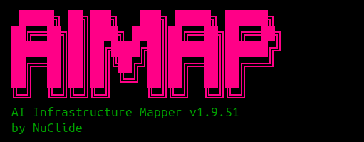
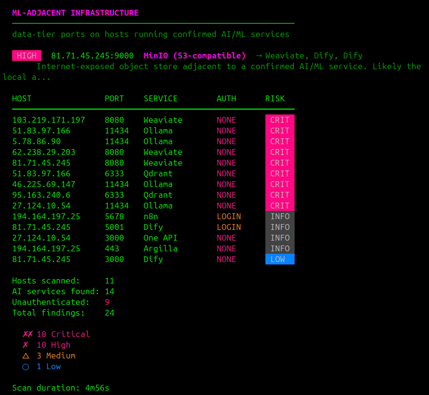
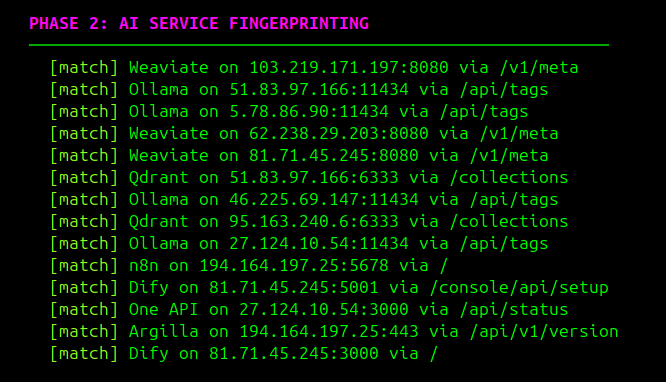

<h1 align="center">
  
  <br>
</h1>

<h4 align="center">A fast vulnerability scanner for AI and machine-learning infrastructure.</h4>

<p align="center">
  <a href="https://github.com/zellkernel/aimap/releases"></a>
  <a href="https://github.com/zellkernel/aimap/blob/main/LICENSE"></a>
  <a href="https://golang.org"></a>
  <a href="https://github.com/zellkernel/aimap/releases"></a>
  <a href="https://"></a>
</p>

<p align="center">
  <a href="#features">Features</a> •
  <a href="#installation">Installation</a> •
  <a href="#usage">Usage</a> •
  <a href="#what-aimap-fingerprints">Fingerprints</a> •
  <a href="#output">Output</a> •
  <a href="#scope">Scope</a>
</p>

<p align="center">
  
</p>

---

aimap is a single Go binary that fingerprints exposed AI and ML services and enumerates what is reachable inside. It opens a TCP connection to each port on the target, matches the response against 218 fingerprints, then runs up to 62 dedicated deep enumerators on whatever answers. The enumerators surface collection names, model lists, experiment metadata, credentials returned in HTTP responses, claimable admin states, and PII fields. Output is a JSON report sized to feed `visorlog ingest`, `winnow`, and SIEM pipelines.

Generic port scanners stop at the open port. aimap reads the service behind it. An Ollama on 11434 lists every model it holds. A Flowise on 3000 can return OpenAI keys from its credentials panel. A Jupyter on 8888 may answer without a token. aimap reports each of those in one pass.

# Features



- 218 service fingerprints across LLM runtimes, vector databases, ML platforms, agent frameworks, model servers, MCP, observability, medical AI, and code assistants
- 62 dedicated deep enumerators that pull data behind the banner, not just identify the banner
- Single static Go binary, zero dependencies, Linux amd64 and arm64 builds
- Conjunctive matcher (`status_code` + `json_field` + `body_contains`) for low false-positive rate at population scale
- 14 hand-curated port profiles (`llm-gateway`, `vector-db`, `observability`, `healthcare`, `mcp`, ...) for fast per-class sweeps
- Bounded concurrent per-item enumeration. Measured 10x speedup on enum-heavy vendors
- JSON report keyed to host, port, service, version, auth status, and risk level
- Adjacency rows mark ML-relevant data tiers sitting next to AI services on the same host
- Honeypot filter (`-exclude-compromised`) drops Meow-class extortion-wiped hosts from the report
- Read-only by design. HTTP GETs and TCP connects. No POSTs, no exploits, no writes

# Installation

```bash
go install -v github.com/zellkernel/aimap@latest
```

Or build from source:

```bash
git clone https://github.com/zellkernel/aimap
cd aimap
go build -o aimap .
```

Pre-built Linux amd64 and arm64 binaries are on the [releases page](https://github.com/zellkernel/aimap/releases). Requires Go 1.21 or later.

# Usage

```console
aimap -target 192.0.2.10
aimap -target 10.0.0.0/24 -threads 50 -o audit.json
aimap -list ips.txt -ports-class llm-gateway -threads 30 -o out.json
aimap -version
```

<details>
  <summary>Full help (aimap -h)</summary>

| Flag | Default | Effect |
|------|---------|--------|
| `-target` | required | single IP, hostname, or CIDR |
| `-list` | | file of targets, one per line. `#` comments supported |
| `-ports` | 42-port default set | comma-separated port list |
| `-ports-class` | | named port profile. Overrides `-ports` |
| `-timeout` | `5s` | per-connection timeout |
| `-threads` | `20` | concurrent scan threads |
| `-o` | | JSON report output file |
| `-v` | off | verbose output |
| `-scan-all-fingerprints` | off | probe every fingerprint on every open port |
| `-exclude-compromised` | off | drop extortion-wiped hosts (Meow-class) |
| `-version` | | print version and exit |

Default 42-port list: `80,443,1984,2379,3000,3001,4000,4040,4200,5000,5001,5678,6333,7575,7576,7860,8000,8001,8080,8081,8088,8123,8233,8265,8443,8501,8787,8888,8889,9000,9090,9091,9200,10000,11434,15500,18080,18789,19530,30000,51000,55000`

</details>

# Port profiles

`-ports-class <name>` narrows the port list to a hand-curated set for a specific service class. On a typical population survey this is a 5x to 10x wall-time reduction over the 42-port default.

| Profile | Ports | Best for |
|---------|-------|----------|
| `llm-gateway` | 12 | Ollama, vLLM, TGI, Open WebUI, LiteLLM, sub2api |
| `vector-db` | 11 | Qdrant, Weaviate, ChromaDB, Milvus |
| `observability` | 10 | Langfuse, Helicone, MLflow, Phoenix, Prometheus |
| `registry` | 11 | Docker, Harbor, Quay |
| `network-mesh` | 19 | Envoy admin, Istio, Linkerd, Kiali, Cilium |
| `workflow-orch` | 10 | Prefect, Dagster, Temporal, Argo |
| `browser-control` | 9 | CDP, Selenium Grid, Playwright MCP |
| `sub2api` | 6 | sub2api-class pooled-account proxies |
| `jetson` | 11 | Jetson edge AI, Triton, Frigate |
| `healthcare` | 10 | DICOM, PACS, dcm4chee, Orthanc |
| `finance` | 10 | QuantConnect, OpenBB, JESSE |
| `mcp` | 9 | Model Context Protocol servers |
| `wide` | 42 | the default catch-all, explicit selection |
| `minimal` | 4 | quick host-alive HTTP probe |

Add a new profile in `port_classes.go`. One map entry. No other files touched.

# What aimap fingerprints

218 services across 27 categories. 62 of them have a dedicated deep enumerator.

| Category | Services |
|----------|----------|
| Vector databases | Weaviate, ChromaDB, Qdrant, Milvus, Marqo, Manticore, SurrealDB, Infinity, Databend, GreptimeDB, Epsilla, OceanBase, Neo4j, Couchbase, Apache Solr, Meilisearch, Typesense, Vespa |
| LLM runtimes | Ollama, llama.cpp server, vLLM, SGLang, LocalAI, text-generation-webui |
| RAG frameworks | AnythingLLM, LightRAG, PrivateGPT, txtai, Cognita, R2R, Kotaemon, Quivr, Danswer/Onyx, Verba, DocsGPT, Ragapp, Perplexica, RAGFlow |
| Image generation | ComfyUI, AUTOMATIC1111 / SD WebUI, InvokeAI, Fooocus, SwarmUI |
| Embedding servers | HuggingFace TEI, infinity-embedding, Embedding API |
| Model serving | TensorFlow Serving, Triton Inference Server, NVIDIA NIM |
| ML platforms | MLflow, Weights & Biases, WandB Service, ClearML, Aim |
| Orchestration / UI | LangServe, Flowise, Dify, Open WebUI, SillyTavern, LiteLLM, One API, NewAPI, BentoML, sub2api |
| AI agent platforms | OpenHands, AutoGen Studio, Anti-detect CDP server, Mem0, Coolify, OpenClaw |
| MCP servers | MCP Server |
| Code assistants | Sourcegraph, Sourcebot, Sweep AI, Tabnine Context Engine, Dyad, bolt.diy, Refact |
| Agent memory | Mem0, Argilla, Zep, Letta |
| Data labeling | Label Studio, CVAT, Doccano, Prodigy |
| Compute orchestration | Ray Serve, Ray Dashboard, Kubeflow, Apache Spark UI, Apache Airflow, Dask Dashboard, Prefect, Temporal Web |
| Container / infra | etcd, Vault, Docker daemon, Kubernetes API, Consul, Portainer, Kubelet |
| Service mesh | Kiali, Hubble UI, Linkerd Viz, Linkerd Proxy Admin, Cilium Metrics, Istio Envoy Admin, Istiod Debug, Pomerium |
| Auth / policy | Open Policy Agent |
| BI / dashboard | Metabase, Apache Superset, Redash, Grafana |
| Observability | Langfuse, Arize Phoenix, Helicone Self-Hosted, Lunary, OpenLIT, Pezzo, Prometheus |
| Workflow automation | n8n |
| Object storage | MinIO |
| Analytical datastores | ClickHouse, Elasticsearch, Apache Pinot, ScyllaDB REST |
| AI safety / eval | Promptfoo, NeMo Guardrails, DeepEval, LangSmith Self-Hosted, Inspect AI, Garak REST, Lakera Guard Self-Hosted, LLM Guard API |
| Voice / audio AI | Whisper ASR, Coqui XTTS, Piper TTS, RVC Voice Cloning, OpenVoice, ChatTTS, F5-TTS, Pipecat, Vocode, LiveKit Agents, AI TTS Server |
| Medical AI / PACS | MONAI Label Server, Orthanc DICOM Server, dcm4che / dcm4chee-arc, DICOMweb (QIDO-RS) |
| Notebooks / dev | Jupyter Notebook, Open Directory, Docker Registry |
| Cross-cutting | Exposed API credentials (Langfuse, Helicone, Stripe, Anthropic, LangSmith, OpenRouter, Slack) |

Deep enumerators pull:

- PII fields in vector DB collections
- Unauthenticated model execution surfaces
- Exposed credentials in HTTP responses
- Claimable admin states (unconfigured Metabase, Flowise credential panels)
- Data counts, schema names, and experiment metadata

# Performance

The deep-enum stage is where the time goes. A vector store with hundreds of collections means hundreds of per-collection metadata reads. aimap runs those reads concurrently with a bounded worker pool. Enum-heavy vendors (Qdrant, ChromaDB, Weaviate, Elasticsearch, ClickHouse) fan out their per-collection, per-class, and per-index probes. Measured on a 157-host unauthenticated Qdrant population: **4:02 to 0:24, about 10x**. Same findings.

What we measured and did not find to be the lever:

- raising `-threads` (host-level concurrency): no change on enum-bound runs
- a per-run GET response cache (`AIMAP_FETCH_CACHE=1`, opt-in): correct, about 8% fewer requests, no wall-time change on its own
- a no-phase-barrier per-host pipeline (`AIMAP_PIPELINE=1`, opt-in): no change on its own

The bottleneck was the serial per-item loop inside the enumerators, not the orchestration. Parallelizing that loop is the speedup. The two opt-in flags are gated off by default and compose with it.

# Output

`-o` writes a `ScanReport`:

```
tool            string
version         string
target          string
timestamp       string
ports_scanned   int
open_ports      []{host, port, open, tls, status_code, server, content_type}
services        []{host, port, service, version, severity, base_url, match_path}
adjacencies     []{...}
enum_results    []{service, host, port, base_url, version, auth_status,
                    risk_level, details, findings[]{category, title, detail,
                    severity, data}, raw_data}
summary         {total_targets, open_ports, services_found, unauthenticated,
                    total_findings, critical, high, medium, low, info,
                    scan_duration}
```

Risk levels: `critical`, `high`, `medium`, `low`, `info`. Escalation rule: `auth == none` plus a `high` finding becomes `critical`. JSON is stable across releases.

# Adding a fingerprint

1. Add a `Fingerprint` struct to `fingerprints.go`. Every probe carries `status_code` plus `json_field` or `body_contains` conjuncts. A naked single-word `body_contains` alone is unsound at population scale. False positives fire on blog posts and marketing pages that mention the product name.
2. Optionally add an `enum<Service>` function to `enumerators.go` and wire it in `runEnumerators`.

# Companion tool: aimap-profile

`aimap-profile/` is a single-file Python tool. Where aimap fingerprints services, aimap-profile profiles the target: identity, WHOIS, ASN, TLS, category (personal, institutional, commercial, research, honeypot), ethics flags (HIPAA exposure, CFAA exposure, safe harbor), PTR neighborhood, disclosure channels (security.txt, bounty programs, abuse contacts). Emits structured JSON for pipeline or LLM consumption.

See [`aimap-profile/README.md`](aimap-profile/README.md).

# Scope

aimap does not authenticate to services, submit forms, POST data, execute exploits, or modify anything on a target. All probes are read-only HTTP GETs and TCP connects. It is an active scanner. It makes real connections. Only scan systems you own or have explicit written authorization to test.

# Our other projects

- [VisorLog](https://github.com/sshpie/visorlog) — finding ledger and ingest pipeline for AI-infra reports
- [VisorGraph](https://github.com/sshpie/visorgraph) — cert-pivot to operator attribution
- [tiptoe](https://github.com/sshpie/tiptoe) — quiet, congestion-controlled assessment for AI infrastructure
- [BARE](https://github.com/sshpie/BARE) — semantic exploit-module ranking over scanner findings
- [recongraph](https://github.com/sshpie/recongraph) — typed provenance graph for multi-source recon

# License

MIT. Part of the  toolchain. Contact: [](https://)
